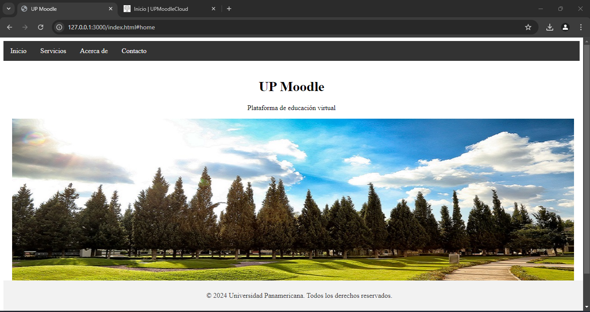
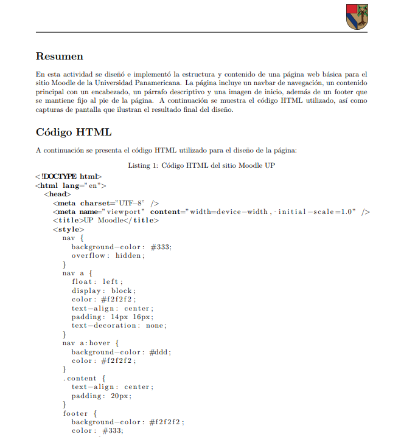

# Proyecto de Desarrollo Web: Implementación de Sitio Moodle UP

## Descripción

Este proyecto consiste en la implementación de una página web básica para el sitio Moodle de la Universidad Panamericana. Se desarrolló utilizando elementos básicos de HTML y CSS, con una estructura sencilla que incluye un menú de navegación, una sección de contenido principal y un footer. Además, se generó un reporte en LaTeX documentando el proceso, con un enfoque en la reutilización de plantillas para futuras tareas.

## Estructura del Proyecto

El proyecto se divide en dos componentes principales:

1. **Página Web en HTML**:
    - **Navbar**: Un menú de navegación simple para acceder a las diferentes secciones de la página.
    - **Contenido Principal**: Incluye un encabezado con el título "UP Moodle", un breve párrafo descriptivo y una imagen de inicio.
    - **Footer**: Un pie de página fijo al final de la página con derechos de autor.

2. **Reporte en LaTeX**:
    - **Portada**: Diseño formal con el logotipo de la Universidad Panamericana, título del proyecto, nombre del autor y fecha.
    - **Resumen**: Breve descripción de la actividad realizada.
    - **Código HTML**: Sección detallada con el código fuente de la página web.
    - **Capturas de Pantalla**: Imágenes de la página web con explicaciones.
    - **Conclusiones**: Resumen de los resultados y aprendizajes obtenidos.
    - **Referencias**: Fuentes consultadas para el desarrollo del proyecto.

## Tecnologías Utilizadas

- **HTML**: Lenguaje de marcado utilizado para la estructura de la página web.
- **CSS**: Lenguaje de estilo utilizado para darle un diseño atractivo y coherente a la página.
- **LaTeX**: Utilizado para la generación del reporte con una presentación formal y profesional.

## Instalación y Uso

### Página Web
1. Clona el repositorio:
    ```bash
    git clone https://github.com/tuusuario/tu-repositorio.git
    ```
2. Navega al directorio del proyecto:
    ```bash
    cd tu-repositorio
    ```
3. Abre el archivo `index.html` en tu navegador preferido.

### Reporte en LaTeX
1. Asegúrate de tener LaTeX instalado en tu sistema.
2. Compila el archivo `reporte.tex` usando el compilador LaTeX de tu preferencia:
    ```bash
    pdflatex reporte.tex
    ```
3. El archivo PDF generado estará disponible en el mismo directorio.

## Capturas de Pantalla

### Vista de la Página Web



### Vista del Reporte en LaTeX



## Contribuciones

Las contribuciones son bienvenidas. Si tienes ideas para mejorar este proyecto, no dudes en abrir un issue o hacer un pull request.

## Licencia

Este proyecto está bajo la Licencia MIT. Consulta el archivo `LICENSE` para obtener más información.

## Autor

- **Jorge Iván Jiménez Reyes** - [LinkedIn](https://www.linkedin.com/in/jorge-ivan-jimenez-reyes)

---

¡Gracias por revisar este proyecto! Si te fue útil, considera darle una estrella al repositorio. 😊
